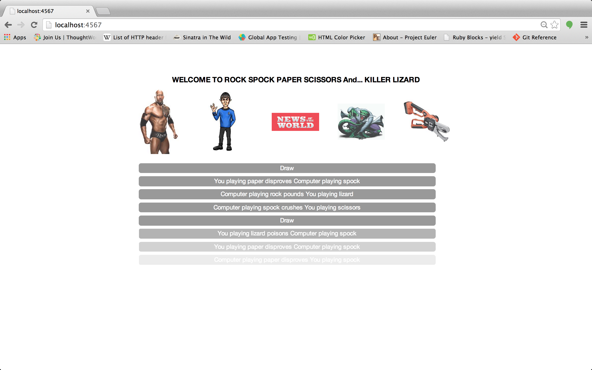

RockPaperScissors
==========

Rockpaperscissors was a neat intro to Javascript. All code is written entirely in JS and was test driven with Jasmine. Despite it being a small project it introduced many new learning points. The user can play a wacky variation of rockpaperscissors against a computer that chooses its move randomly

Technologies & Learning outcomes
----
- Intro to Javascript
- Intro to the JQuery library
- TDD/Jasmine
- Chrome console

How to demo
----
git clone git@github.com:robindoble/rockpaperscissors.git
run server.rb (sinatra app)

